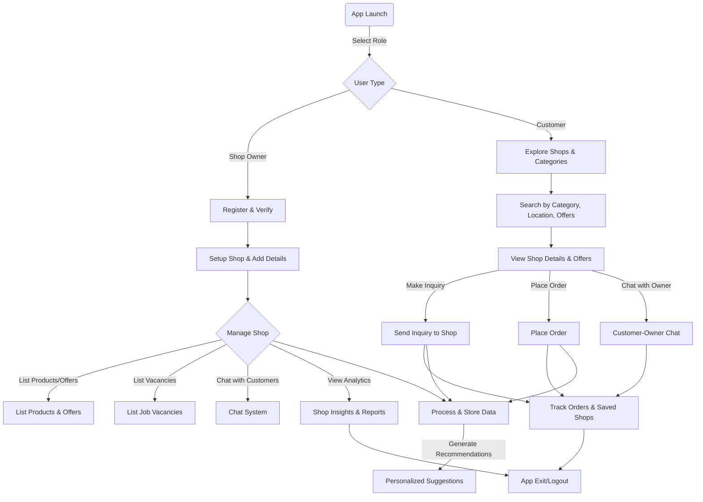

```mermaid
graph TD;
    Start(App Launch) -->|Select Role| Role{User Type};
    
    Role -->|Shop Owner| ShopReg[Register & Verify]
    Role -->|Customer| Explore[Explore Shops & Categories]
    
    %% Shop Owner Flow
    ShopReg --> ShopSetup[Setup Shop & Add Details]
    ShopSetup --> ShopActions{Manage Shop}
    
    ShopActions -->|List Products/Offers| ListProducts[List Products & Offers]
    ShopActions -->|List Vacancies| ListVacancies[List Job Vacancies]
    ShopActions -->|Chat with Customers| Chat[Chat System]
    ShopActions -->|View Analytics| Analytics[Shop Insights & Reports]
    
    %% Customer Flow
    Explore --> Search[Search by Category, Location, Offers]
    Search --> ShopView[View Shop Details & Offers]
    ShopView -->|Make Inquiry| Inquiry[Send Inquiry to Shop]
    ShopView -->|Place Order| Order[Place Order]
    ShopView -->|Chat with Owner| ChatCustomer[Customer-Owner Chat]
    
    %% User Profile & History
    Order --> UserProfile[Track Orders & Saved Shops]
    Inquiry --> UserProfile
    ChatCustomer --> UserProfile
    
    %% Backend Processes
    ShopActions --> Backend[Process & Store Data]
    Order --> Backend
    Inquiry --> Backend
    Backend -->|Generate Recommendations| Recommendations[Personalized Suggestions]

    %% End Flow
    UserProfile --> End[App Exit/Logout]
    Analytics --> End
```