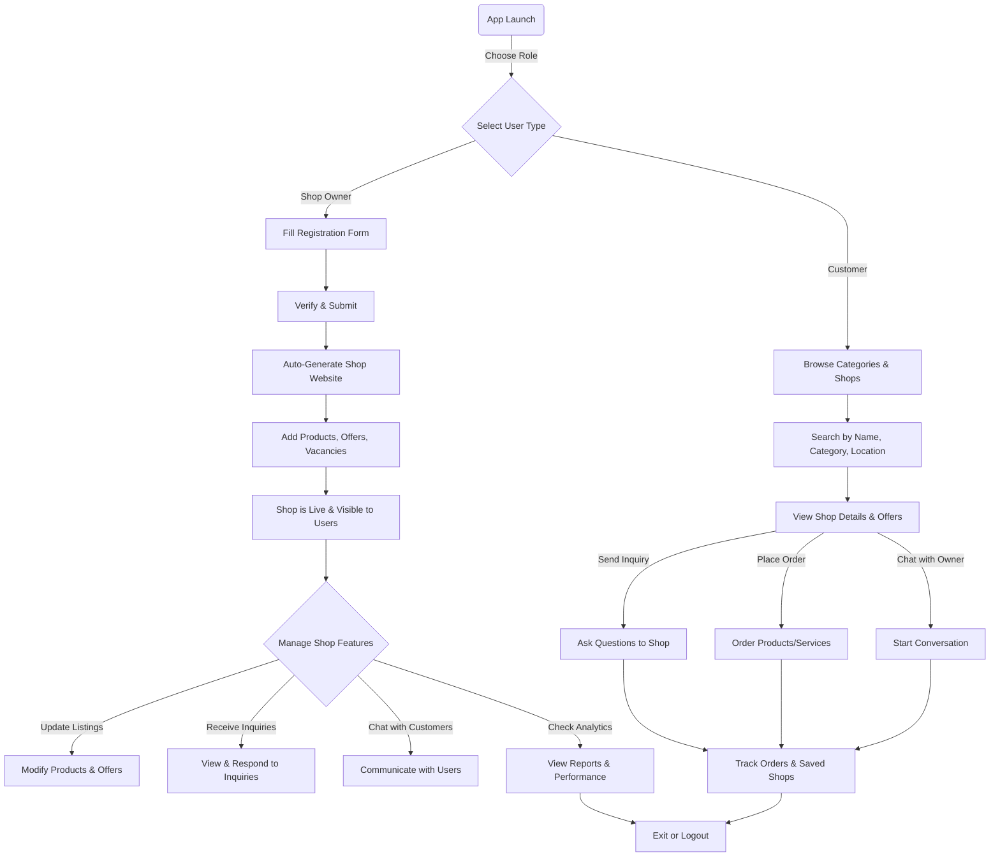

```mermaid
graph TD;
    Start(App Launch) -->|Choose Role| Role{Select User Type};
    
    %% Shop Owner Flow
    Role -->|Shop Owner| ShopReg[Fill Registration Form]
    ShopReg --> Verify[Verify & Submit]
    Verify --> GenWebsite[Auto-Generate Shop Website]
    GenWebsite --> AddDetails[Add Products, Offers, Vacancies]
    AddDetails --> ShopLive[Shop is Live & Visible to Users]
    ShopLive --> ManageShop{Manage Shop Features}
    
    ManageShop -->|Update Listings| Update[Modify Products & Offers]
    ManageShop -->|Receive Inquiries| Inquiry[View & Respond to Inquiries]
    ManageShop -->|Chat with Customers| Chat[Communicate with Users]
    ManageShop -->|Check Analytics| Analytics[View Reports & Performance]

    %% Customer Flow
    Role -->|Customer| Explore[Browse Categories & Shops]
    Explore --> Search[Search by Name, Category, Location]
    Search --> ViewShop[View Shop Details & Offers]
    
    ViewShop -->|Send Inquiry| CustomerInquiry[Ask Questions to Shop]
    ViewShop -->|Place Order| PlaceOrder[Order Products/Services]
    ViewShop -->|Chat with Owner| CustomerChat[Start Conversation]

    %% User Profile & History
    PlaceOrder --> OrderHistory[Track Orders & Saved Shops]
    CustomerInquiry --> OrderHistory
    CustomerChat --> OrderHistory

    %% End Flow
    OrderHistory --> End[Exit or Logout]
    Analytics --> End
```